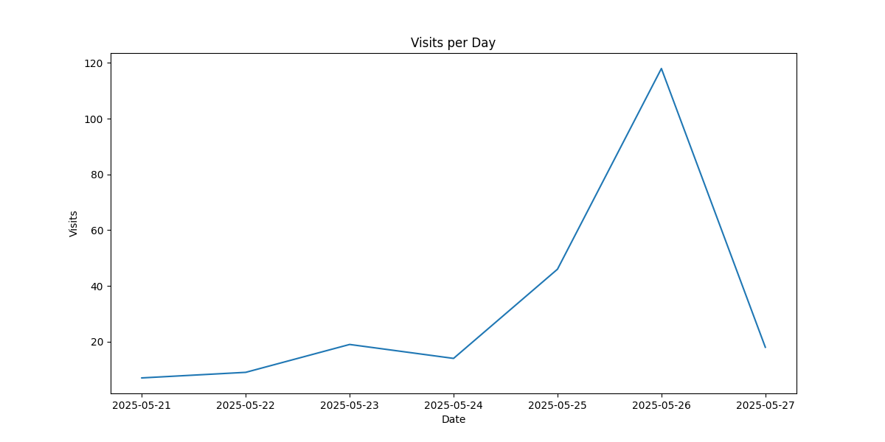
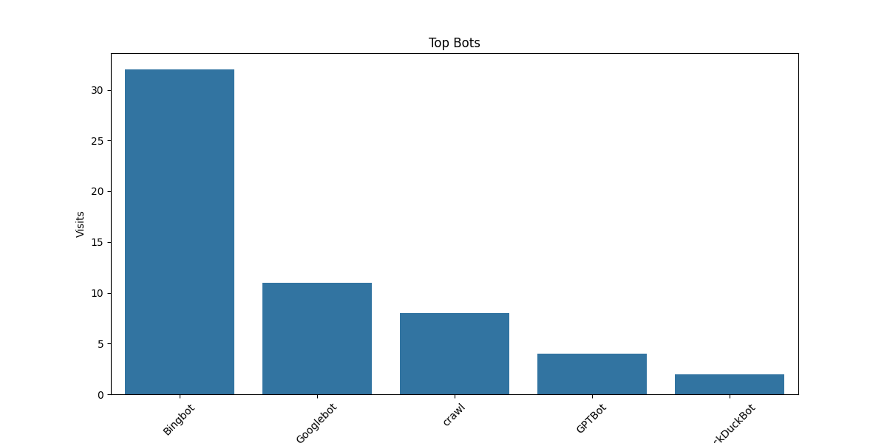
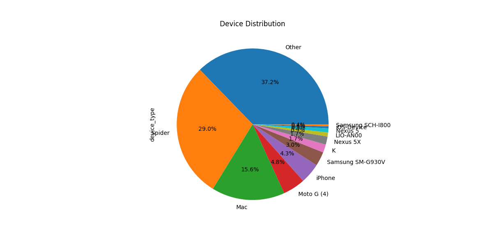
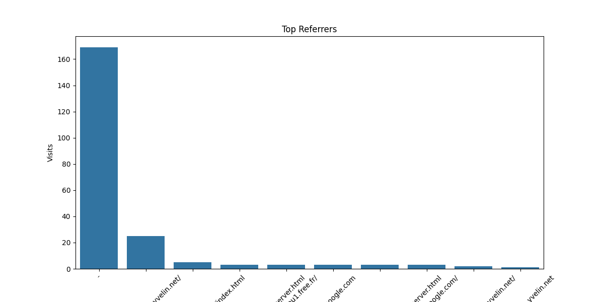

# Log Analysis Report

## Visits per Day


## Visits per Hour


## Top Bots


## Device Distribution


## Browser Distribution


## OS Distribution


## Top Referrers


## Top URLs


## Session Durations


## Summary

### Visits per Day
```
datetime
2025-05-21      7
2025-05-22      9
2025-05-23     19
2025-05-24     14
2025-05-25     46
2025-05-26    118
2025-05-27     18
Name: visits, dtype: int64
```

### Visits per Hour
```
datetime
0     14
1      5
2      6
3      3
5      1
6     10
7      1
8      2
9      9
10    42
11    17
13     5
14    11
15     6
16    15
17     3
18     7
19     4
20    16
21     7
22    10
23    37
Name: visits, dtype: int64
```

### Top Bots
```
Bingbot        32
Googlebot      11
crawl           8
GPTBot          4
DuckDuckBot     2
Name: bot_name, dtype: int64
```

### Top Referrers
```
-                                                     169
https://loucantou.yvelin.net/                          25
https://loucantou.yvelin.net/en/index.html              5
https://loucantou.yvelin.net/en/r%C3%A9server.html      3
http://loucantou1.free.fr/                              3
http://google.com                                       3
https://loucantou.yvelin.net/r%C3%A9server.html         3
https://www.google.com/                                 3
https://www.loucantou.yvelin.net/                       2
http://loucantou.yvelin.net                             1
Name: referrer, dtype: int64
```

### Top URLs
```
/                                         114
/robots.txt                                19
/en/                                        8
/assets/icons/olive.svg                     8
/assets/photos/webp/breakfast-800.webp      8
/en/index.html                              7
/index.html                                 5
/sitemap.xml                                5
/r%C3%A9server.html                         5
/en/r%C3%A9server.html                      4
Name: url, dtype: int64
```

### Device Distribution
```
Other               86
Spider              67
Mac                 36
Moto G (4)          11
iPhone              10
Samsung SM-G930V     7
K                    4
Nexus 5X             4
LIO-AN00             2
Nexus 5              2
iOS-Device           1
Samsung SCH-I800     1
Name: device_type, dtype: int64
```

### Browser Distribution
```
Chrome                   56
bingbot                  32
Edge                     28
Chrome Mobile            25
Other                    13
Discordbot               10
Googlebot                10
HeadlessChrome            9
SiteCheckerBotCrawler     8
Mobile Safari             7
Edge Mobile               5
Firefox                   4
com/bot                   4
Safari                    4
MJ12bot                   3
Chrome Mobile WebView     2
DuckDuckBot               2
OAI-SearchBot             2
Googlebot-Image           1
tc-bot                    1
IE                        1
CFNetwork                 1
curl                      1
Go-http-client            1
Android                   1
Name: browser, dtype: int64
```

### OS Distribution
```
Other       77
Windows     52
Android     39
Mac OS X    36
Linux       15
iOS         12
Name: os, dtype: int64
```

### Error Rates
```
0
```
    