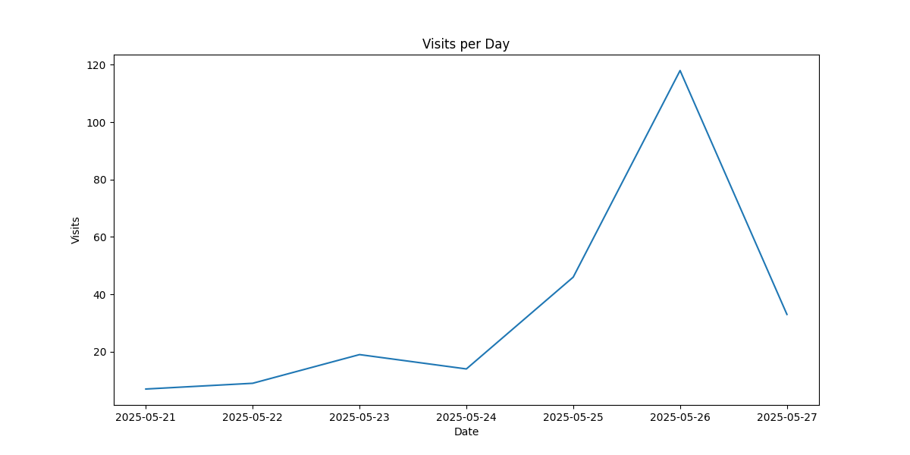
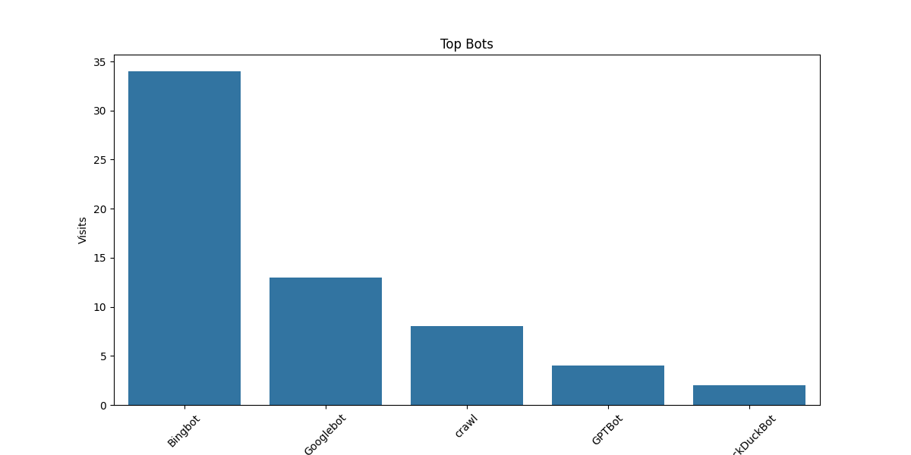
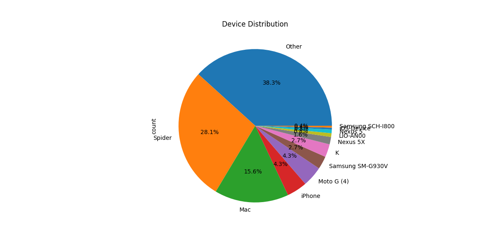
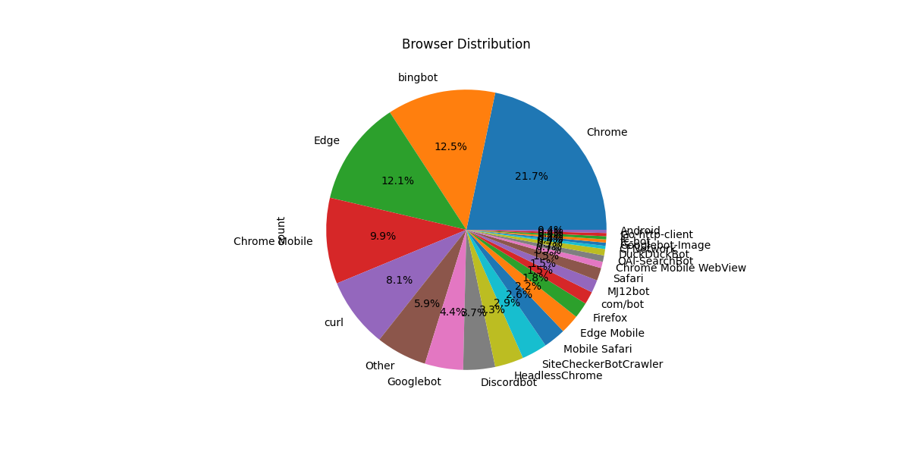
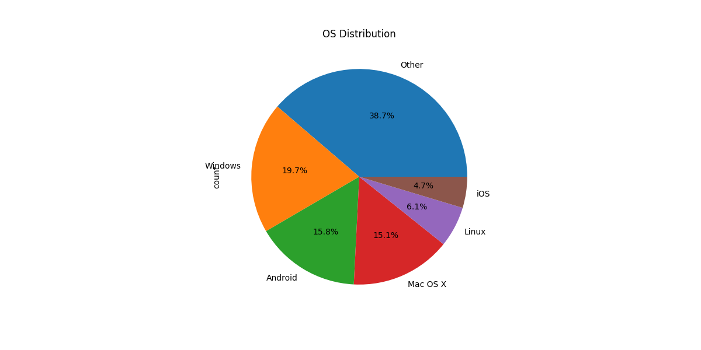
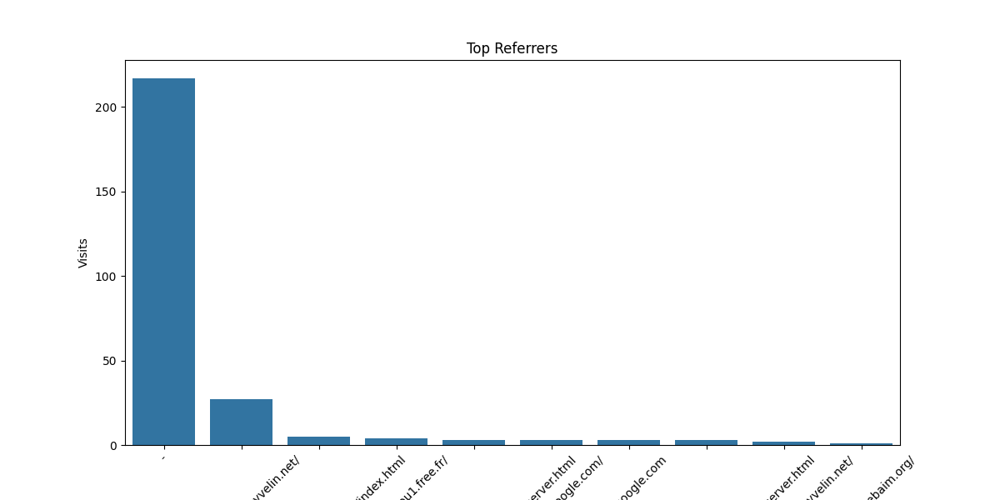
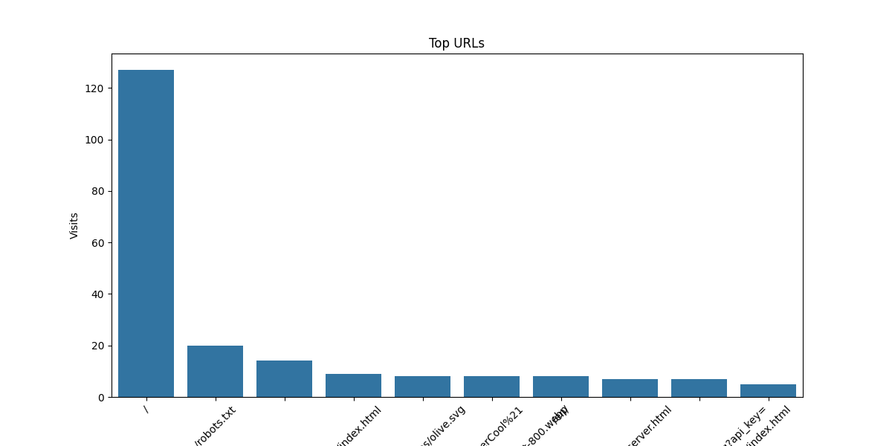
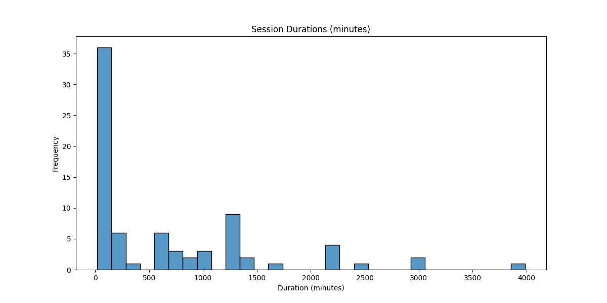

# Log Analysis Report

## Visits per Day


## Visits per Hour


## Top Bots


## Device Distribution


## Browser Distribution


## OS Distribution


## Top Referrers


## Top URLs


## Session Durations


## Summary

### Visits per Day
```
datetime
2025-05-21      7
2025-05-22      9
2025-05-23     19
2025-05-24     14
2025-05-25     46
2025-05-26    118
2025-05-27     66
Name: visits, dtype: int64
```

### Visits per Hour
```
datetime
0     14
1      5
2      6
3      3
5      1
6     10
7      1
8      2
9      9
10    43
11    32
12     4
13     7
14    14
15     8
16    22
17    14
18    10
19     4
20    16
21     7
22    10
23    37
Name: visits, dtype: int64
```

### Top Bots
```
bot_name
Bingbot        34
Googlebot      13
crawl           8
GPTBot          4
DuckDuckBot     2
Name: count, dtype: int64
```

### Top Referrers
```
referrer
-                                                     214
https://loucantou.yvelin.net/                          27
https://loucantou.yvelin.net/en/index.html              5
http://loucantou1.free.fr/                              4
https://loucantou.yvelin.net/r%C3%A9server.html         3
https://www.google.com/                                 3
http://google.com                                       3
https://loucantou.yvelin.net/en/r%C3%A9server.html      3
https://www.loucantou.yvelin.net/                       2
https://wave.webaim.org/                                1
Name: count, dtype: int64
```

### Top URLs
```
url
/                                                                                                                    127
/robots.txt                                                                                                           20
/logs/loucantou-access.log?api_key=UneCl%C3%A9ApiPourEmp%C3%AAcherLesMalfratsDeSintriduireDansMonSiteSuperCool%21     13
/en/index.html                                                                                                         9
/assets/icons/olive.svg                                                                                                8
/assets/photos/webp/breakfast-800.webp                                                                                 8
/en/                                                                                                                   8
/r%C3%A9server.html                                                                                                    7
/logs/loucantou-access.log?api_key=                                                                                    7
/index.html                                                                                                            5
Name: count, dtype: int64
```

### Device Distribution
```
device_type
Other               119
Spider               72
Mac                  42
iPhone               11
Moto G (4)           11
Samsung SM-G930V      7
K                     7
Nexus 5X              4
LIO-AN00              2
Nexus 5               2
iOS-Device            1
Samsung SCH-I800      1
Name: count, dtype: int64
```

### Browser Distribution
```
browser
Chrome                   61
bingbot                  34
Edge                     33
Chrome Mobile            27
curl                     25
Other                    17
Googlebot                12
Discordbot               10
HeadlessChrome            9
SiteCheckerBotCrawler     8
Mobile Safari             7
Edge Mobile               6
Firefox                   5
Safari                    4
com/bot                   4
MJ12bot                   4
DuckDuckBot               2
Chrome Mobile WebView     2
OAI-SearchBot             2
CFNetwork                 1
tc-bot                    1
Googlebot-Image           1
IE                        1
Go-http-client            1
Android                   1
Samsung Internet          1
Name: count, dtype: int64
```

### OS Distribution
```
os
Other       108
Windows      55
Android      44
Mac OS X     42
Linux        17
iOS          13
Name: count, dtype: int64
```

### Error Rates
```
0
```

