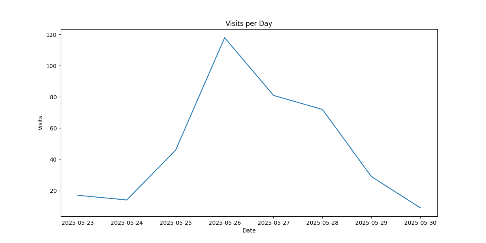
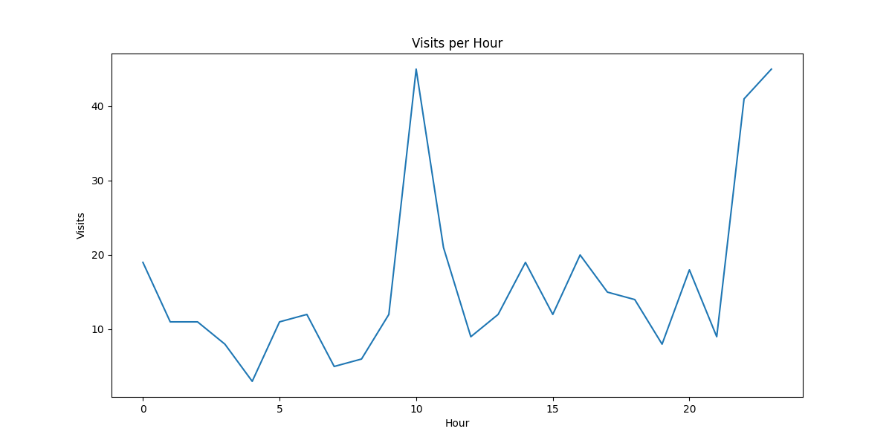
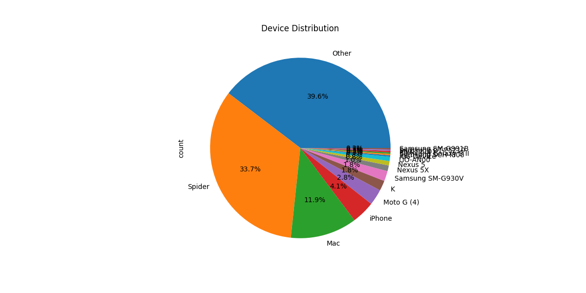
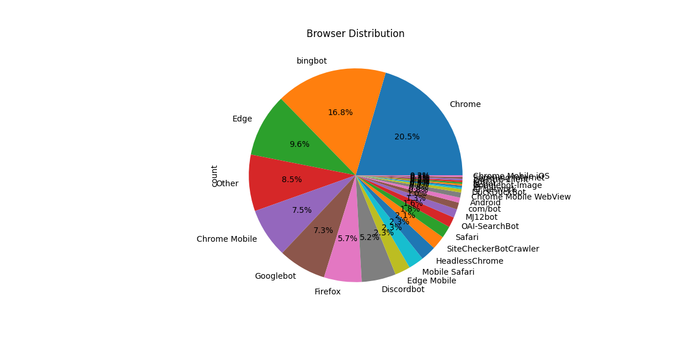
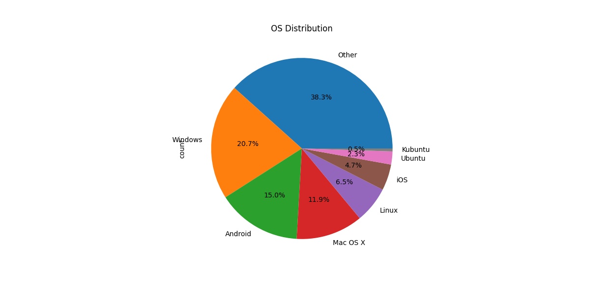
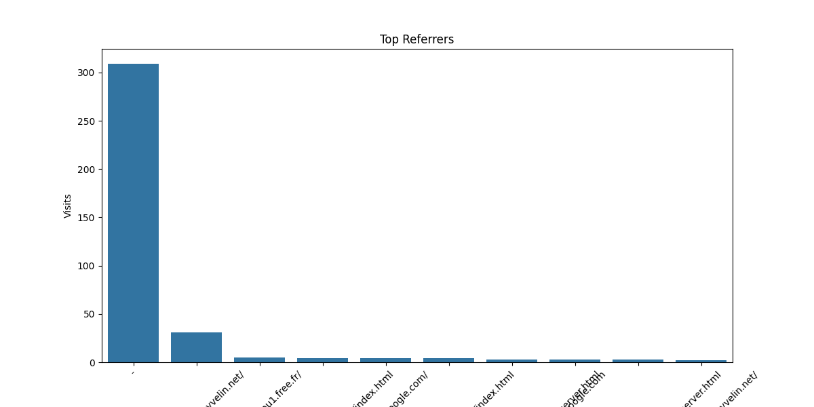
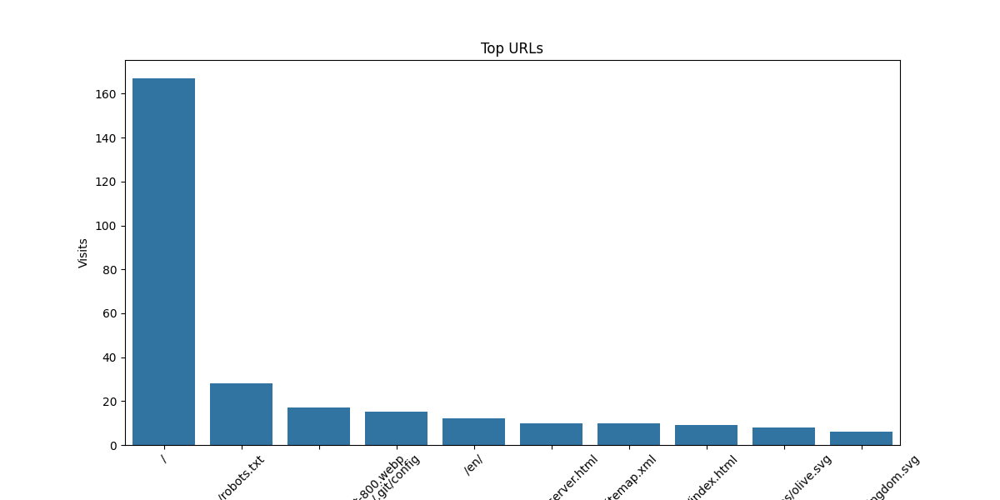
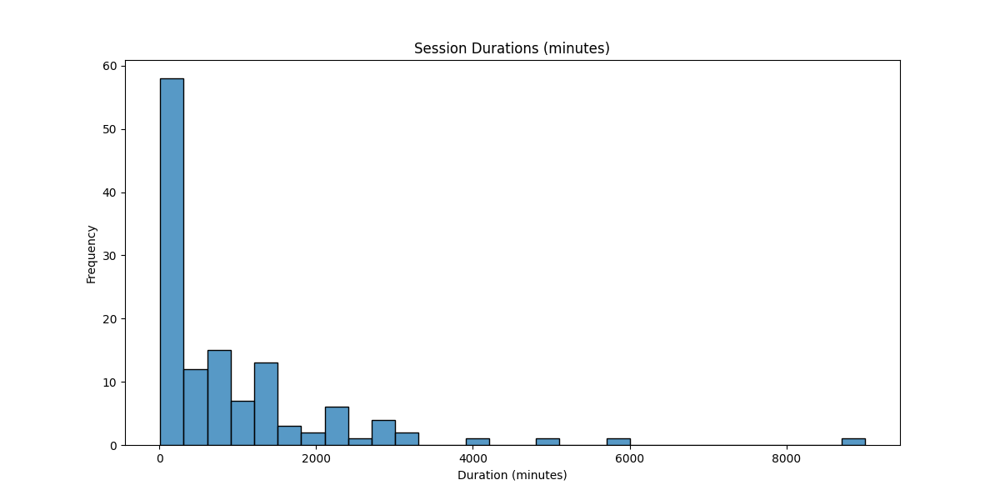

# Log Analysis Report

## Visits per Day

## Visits per Hour

## Top Bots

## Device Distribution

## Browser Distribution

## OS Distribution

## Top Referrers

## Top URLs

## Session Durations

## Summary

### Visits per Day
| datetime   |   visits |
|:-----------|---------:|
| 2025-05-23 |       17 |
| 2025-05-24 |       14 |
| 2025-05-25 |       46 |
| 2025-05-26 |      118 |
| 2025-05-27 |       81 |
| 2025-05-28 |       72 |
| 2025-05-29 |       29 |
| 2025-05-30 |        9 |

### Visits per Hour
|   datetime |   visits |
|-----------:|---------:|
|          0 |       19 |
|          1 |       11 |
|          2 |       11 |
|          3 |        8 |
|          4 |        3 |
|          5 |       11 |
|          6 |       12 |
|          7 |        5 |
|          8 |        6 |
|          9 |       12 |
|         10 |       45 |
|         11 |       21 |
|         12 |        9 |
|         13 |       12 |
|         14 |       19 |
|         15 |       12 |
|         16 |       20 |
|         17 |       15 |
|         18 |       14 |
|         19 |        8 |
|         20 |       18 |
|         21 |        9 |
|         22 |       41 |
|         23 |       45 |

### Top Bots
| bot_name    |   count |
|:------------|--------:|
| Bingbot     |      65 |
| Googlebot   |      29 |
| crawl       |       8 |
| GPTBot      |       4 |
| DuckDuckBot |       2 |

### Top Referrers
| referrer                                           |   count |
|:---------------------------------------------------|--------:|
| -                                                  |     309 |
| https://loucantou.yvelin.net/                      |      31 |
| http://loucantou1.free.fr/                         |       5 |
| https://loucantou.yvelin.net/en/index.html         |       4 |
| https://www.google.com/                            |       4 |
| https://loucantou.yvelin.net/index.html            |       4 |
| https://loucantou.yvelin.net/en/r%C3%A9server.html |       3 |
| http://google.com                                  |       3 |
| https://loucantou.yvelin.net/r%C3%A9server.html    |       3 |
| https://www.loucantou.yvelin.net/                  |       2 |

### Top URLs
| url                                    |   count |
|:---------------------------------------|--------:|
| /                                      |     167 |
| /robots.txt                            |      28 |
| /assets/photos/webp/breakfast-800.webp |      17 |
| /.git/config                           |      15 |
| /en/                                   |      12 |
| /r%C3%A9server.html                    |      10 |
| /sitemap.xml                           |      10 |
| /en/index.html                         |       9 |
| /assets/icons/olive.svg                |       8 |
| /assets/united-kingdom.svg             |       6 |

### Device Distribution
| device_type         |   count |
|:--------------------|--------:|
| Other               |     153 |
| Spider              |     130 |
| Mac                 |      46 |
| iPhone              |      16 |
| Moto G (4)          |      11 |
| K                   |       7 |
| Samsung SM-G930V    |       7 |
| Nexus 5X            |       4 |
| Nexus 5             |       3 |
| LIO-AN00            |       3 |
| iOS-Device          |       1 |
| Samsung SCH-I800    |       1 |
| Samsung Galaxy S II |       1 |
| MVK-T2101           |       1 |
| Samsung GT-P5210    |       1 |
| Samsung SM-G991B    |       1 |

### Browser Distribution
| browser               |   count |
|:----------------------|--------:|
| Chrome                |      79 |
| bingbot               |      65 |
| Edge                  |      37 |
| Other                 |      33 |
| Chrome Mobile         |      29 |
| Googlebot             |      28 |
| Firefox               |      22 |
| Discordbot            |      20 |
| Edge Mobile           |       9 |
| Mobile Safari         |       9 |
| HeadlessChrome        |       9 |
| SiteCheckerBotCrawler |       8 |
| Safari                |       7 |
| OAI-SearchBot         |       6 |
| MJ12bot               |       5 |
| com/bot               |       4 |
| Android               |       3 |
| Chrome Mobile WebView |       3 |
| DuckDuckBot           |       2 |
| CFNetwork             |       1 |
| IE                    |       1 |
| Googlebot-Image       |       1 |
| tc-bot                |       1 |
| curl                  |       1 |
| Go-http-client        |       1 |
| Samsung Internet      |       1 |
| Chrome Mobile iOS     |       1 |

### OS Distribution
| os       |   count |
|:---------|--------:|
| Other    |     148 |
| Windows  |      80 |
| Android  |      58 |
| Mac OS X |      46 |
| Linux    |      25 |
| iOS      |      18 |
| Ubuntu   |       9 |
| Kubuntu  |       2 |

### Error Rates
0
